## 1. kérdés: Mutassa be az alapfogalmakat (tudástípusok, BAU, projekt, projektmenedzsment)! 
### (moodle szoftvertech 8. előadás)
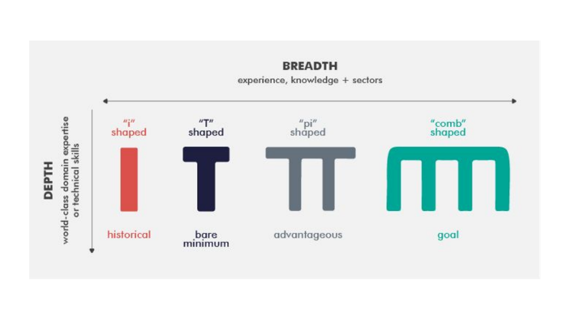
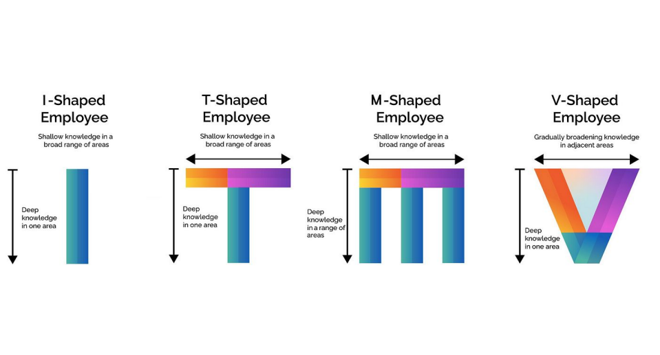
---
---
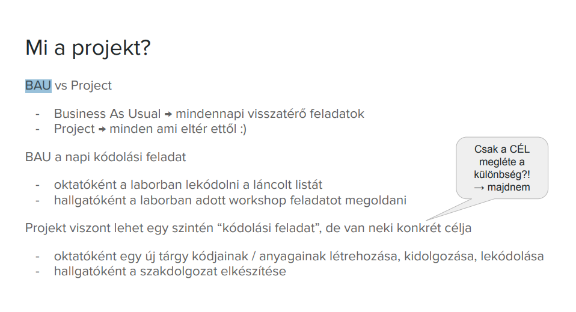
---
---
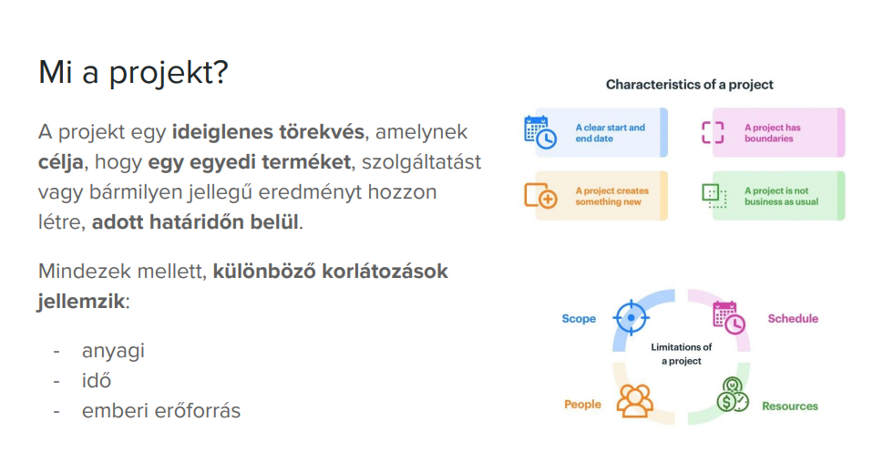
---
---
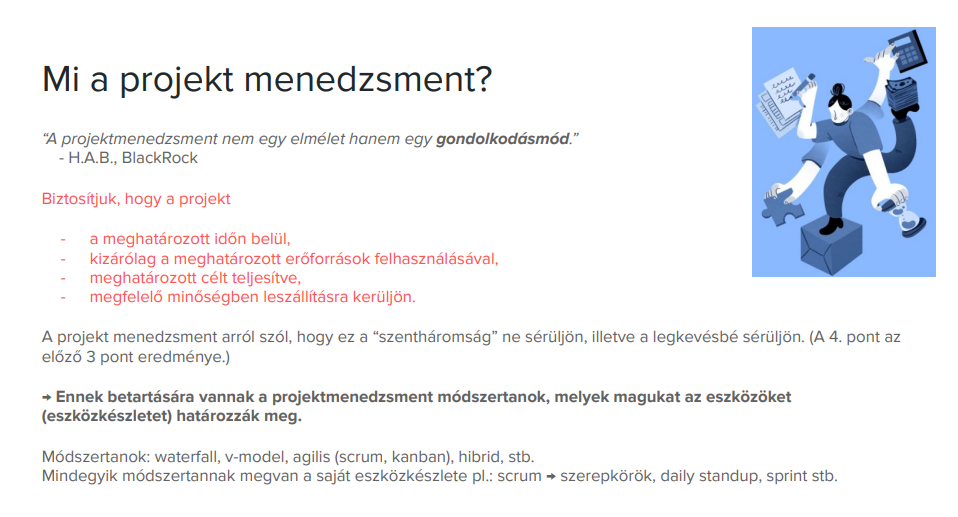
---
## 2. kérdés: Mutassa be a RAID logot!
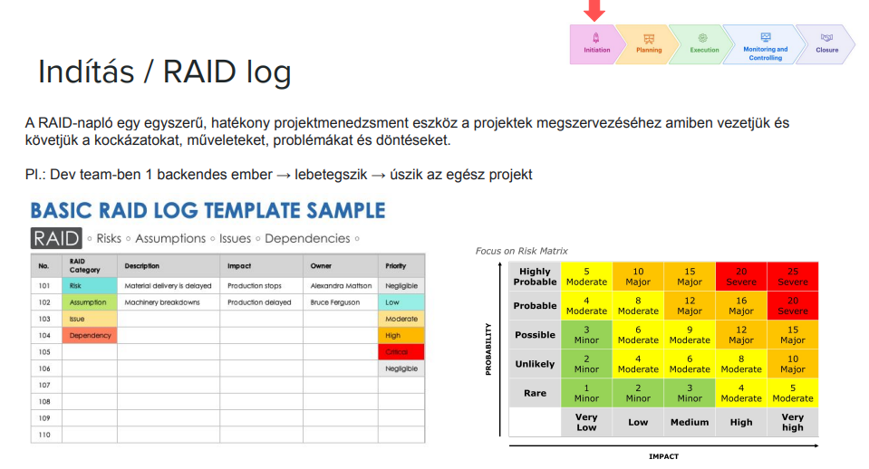
## 3. kérdés: Mutassa be milyen szakaszai vannak egy projektnek és ezekben mik történnek!
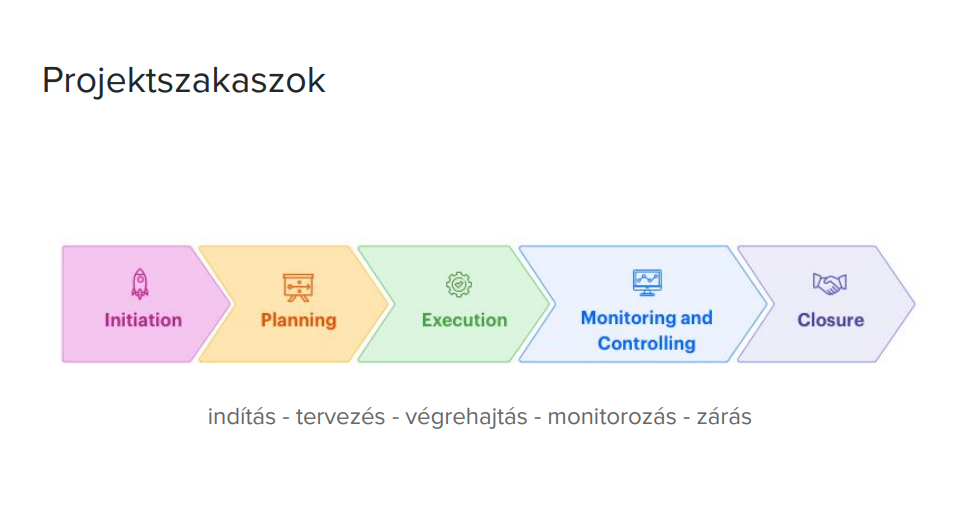
### AZ előző RAID logos ábra is ide tartozik!
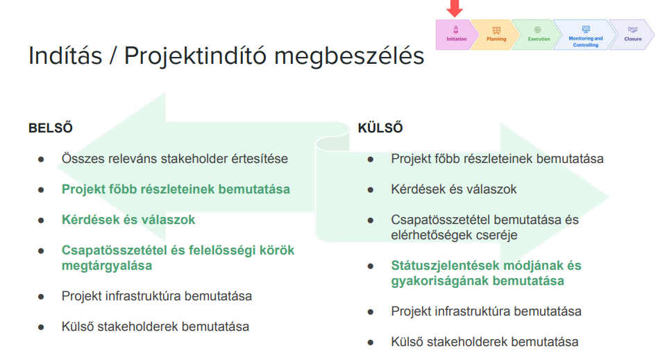
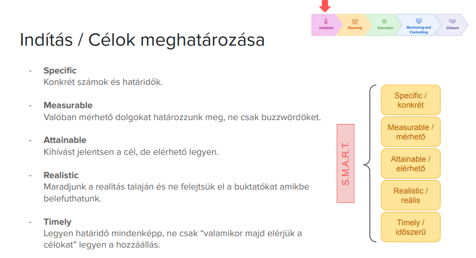
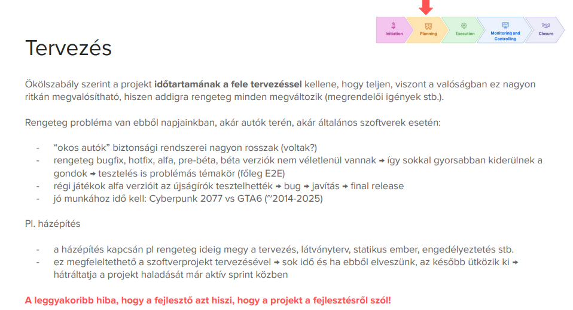
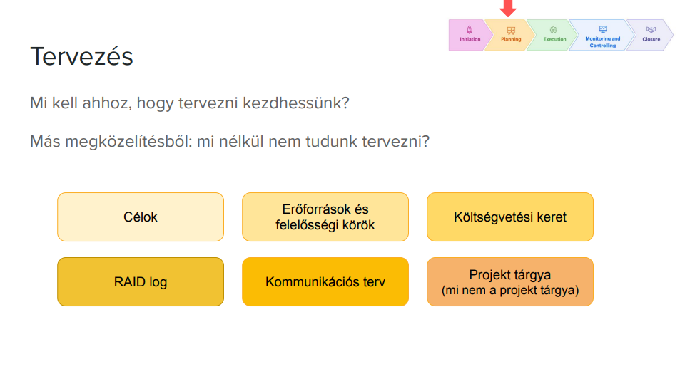
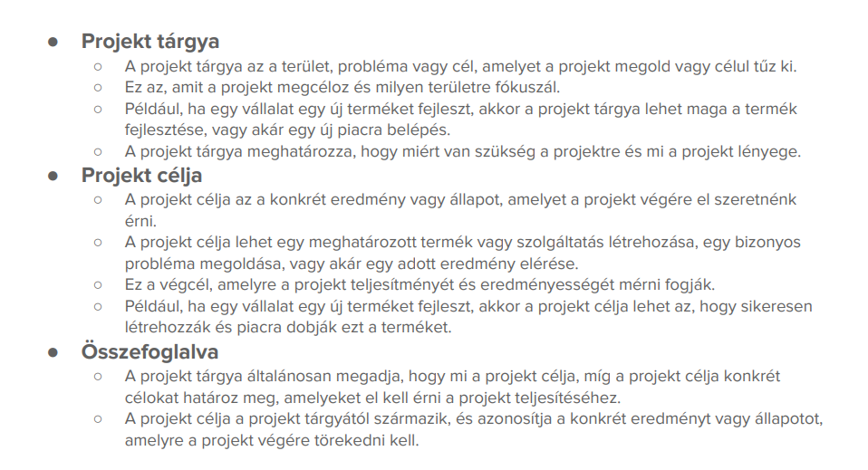
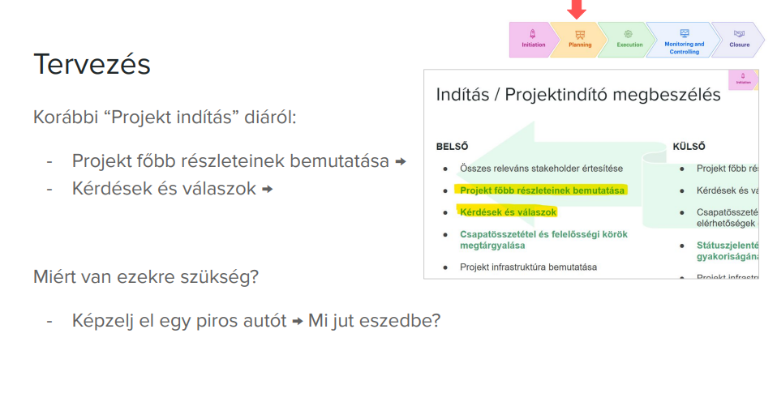
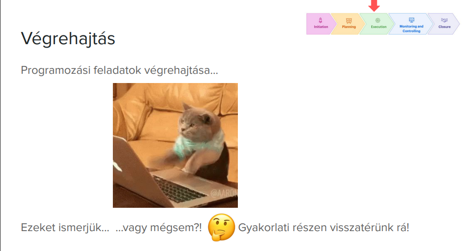
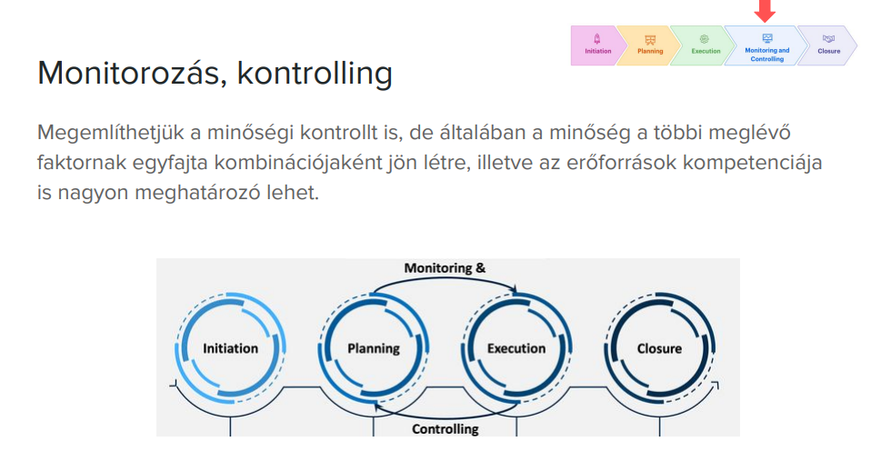
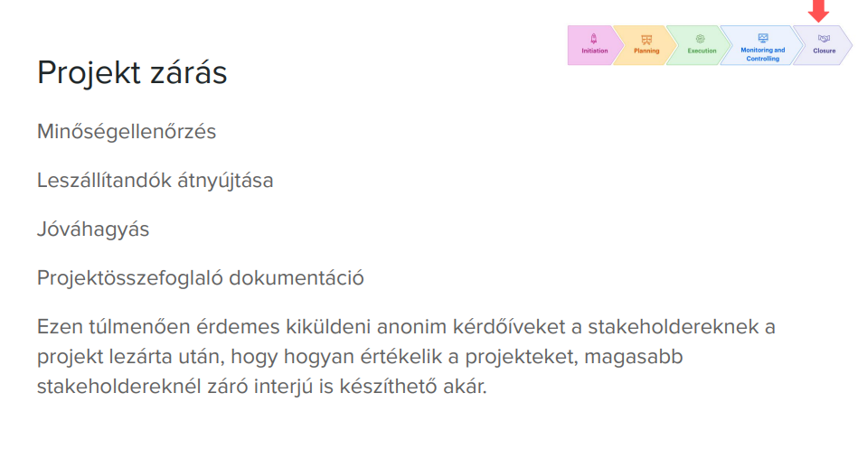