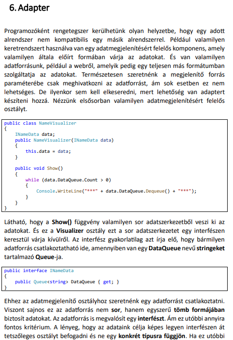
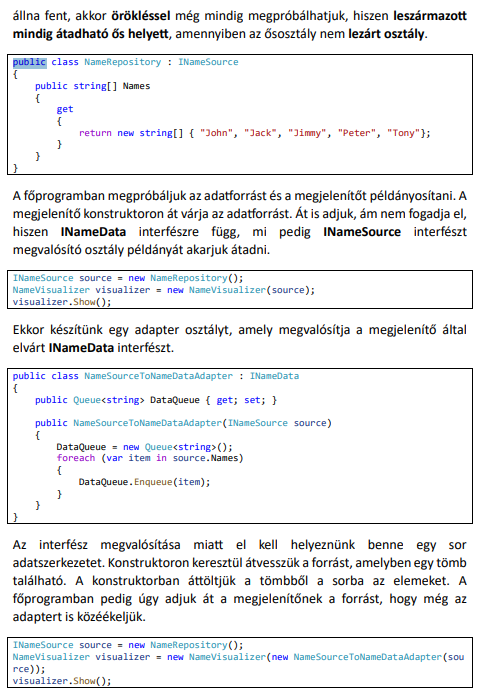
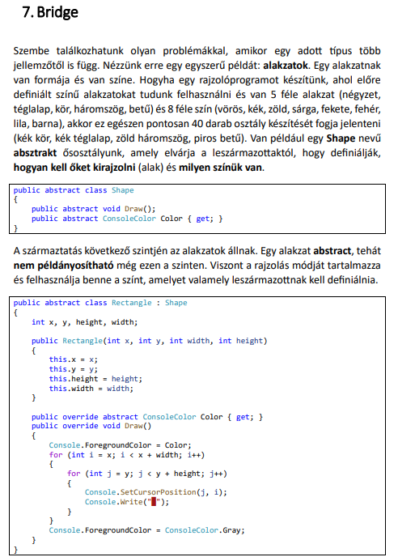
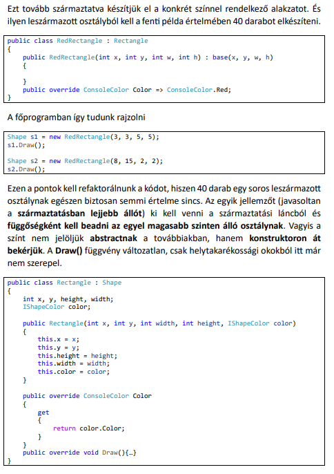
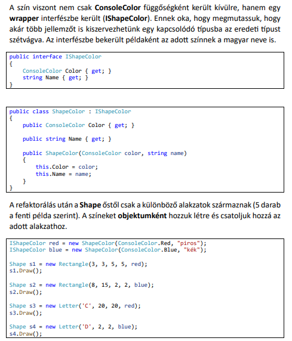
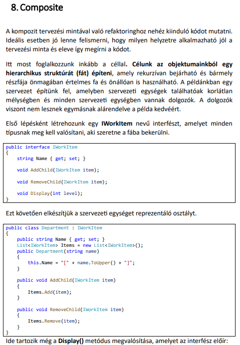
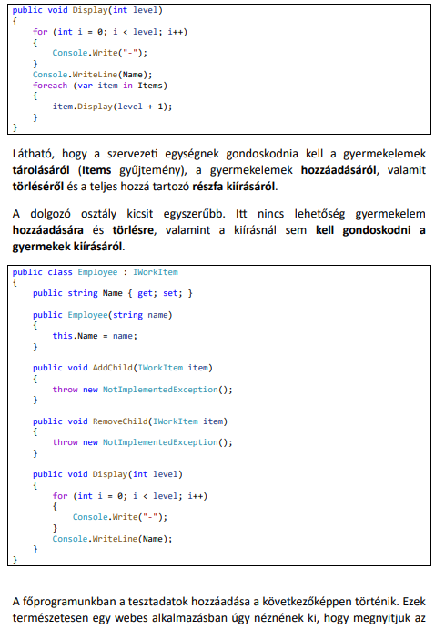
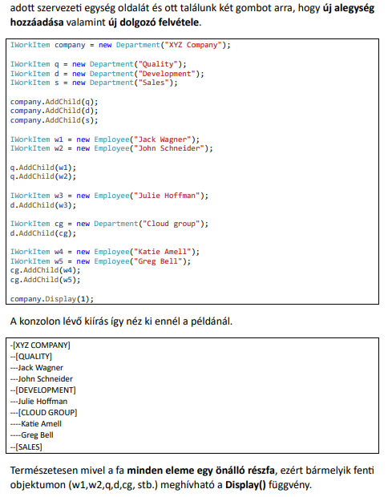
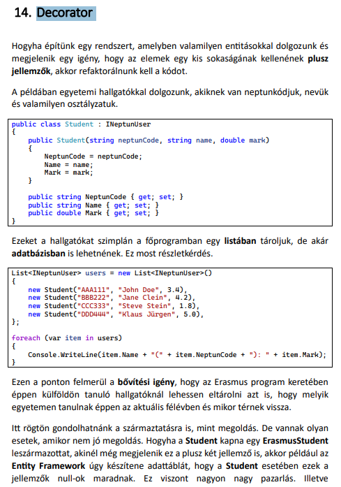
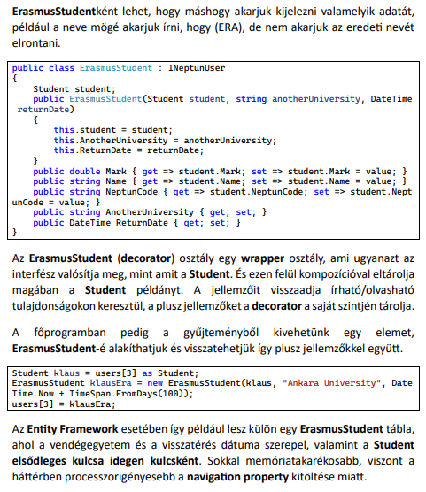

## 1. kérdés: Mutassa be a tervezési minták alapvető céljait!

- "Érdemes napjainkban ezeket a mintákat áttekinteni, saját problémákra
alkalmazni, mert a segítségükkel jól fenntartható, szépen strukturált kódot
kapunk."

ChatGPT válasza:

Fő céljaik:
```.txt
- Újrafelhasználhatóság növelése
    Ne kelljen minden problémára teljesen új megoldást írni.

- Karbantarthatóság javítása
    A jól felépített kód könnyebben módosítható és hibajavítható.

- Rugalmasabb rendszer kialakítása
    A program könnyebben bővíthető új funkciókkal.

- Laza csatolás biztosítása
    Az egyes osztályok és komponensek kevésbé függjenek egymástól.

- Átláthatóbb kód létrehozása
    Egységes szerkezetet és könnyebb megértést biztosítanak.

- Kommunikáció megkönnyítése fejlesztők között
    Egy minta neve önmagában leír egy ismert megoldást
    (pl. Singleton, Factory, Observer).

- Fejlesztési idő csökkentése
    Bevált megoldások használatával gyorsabb a fejlesztés.
```
## 2. kérdés: Mutassa be az Adapter és Bridge tervezési mintákat!
### ADAPTER



Ez az adapter minta teljesen ugyanaz a koncepció, mint fizikai termékek esetén a
különböző átalakítókábelek és adapterek. Vásárolunk egy ultrabookot, amelyen
már csak USB-C port található, mi viszont szeretnénk egy USB-A csatlakozóval
ellátott egeret csatlakoztatni. Nem lehet fizikailag csatlakoztatni. Ezért gyártottak
egy adaptert, amely megvalósítja a cél által elvárt interfészt (kerül rá egy USB-C
dugó) és várja egy aljzat formájában USB-A eszközök csatlakoztatását. A
csatlakoztatásnál ez is konkrétan a forrás és a cél közé ékelődik be egy toldás
formájában. 

### BRIDGE




## 3. kérdés: Mutassa be a Composite és Decorator tervezési mintákat!
### Composite



### Decorator


