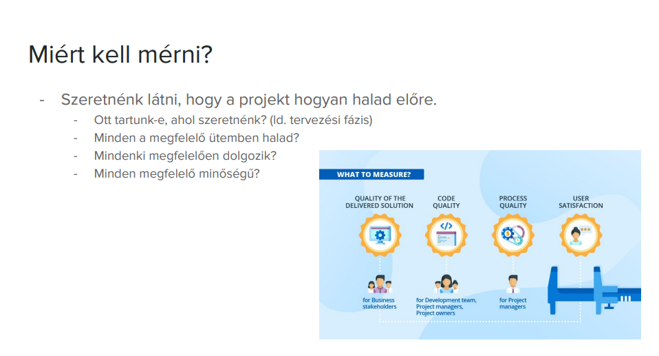
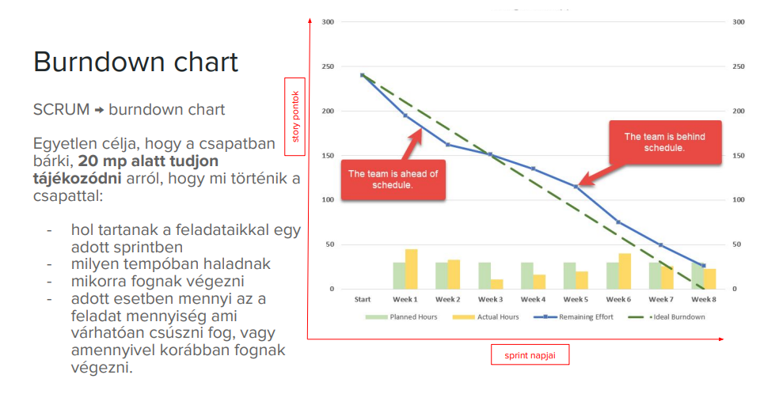
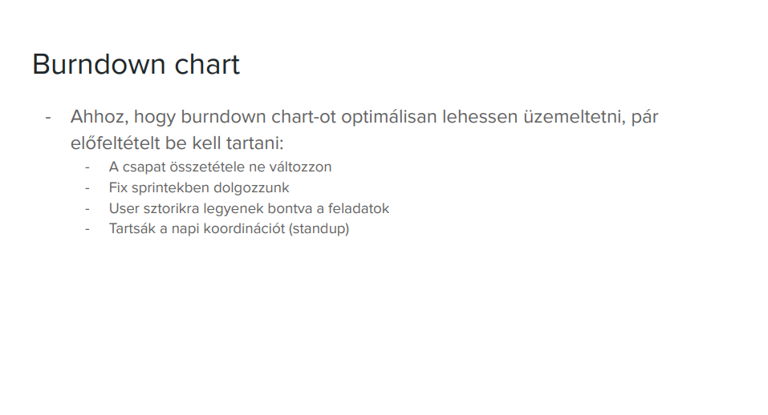
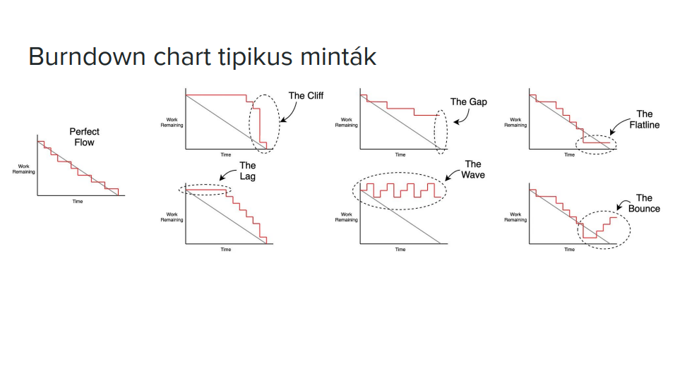
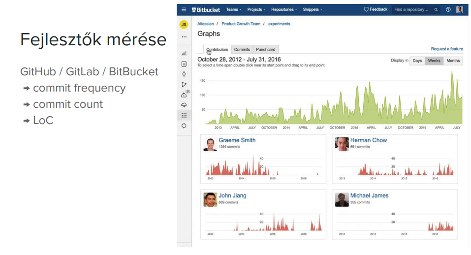
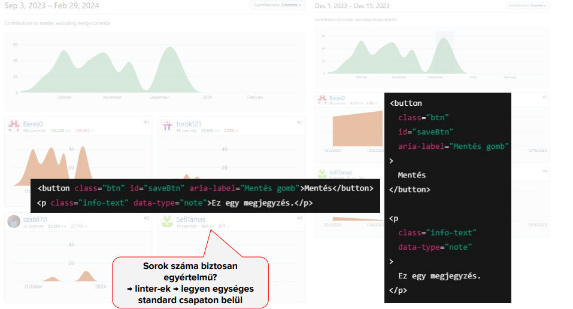
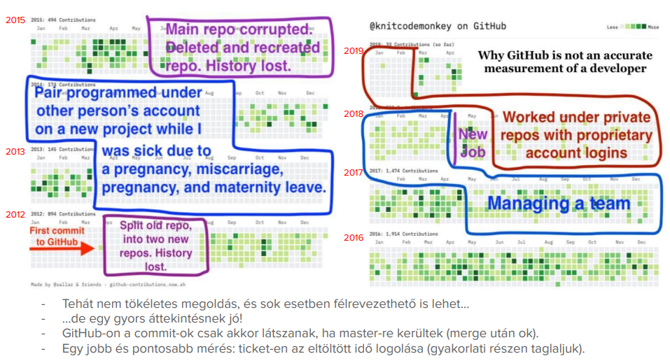
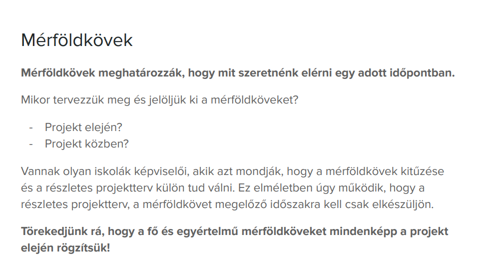
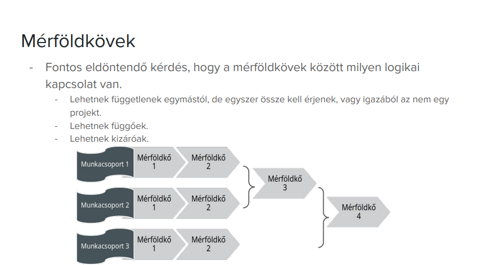
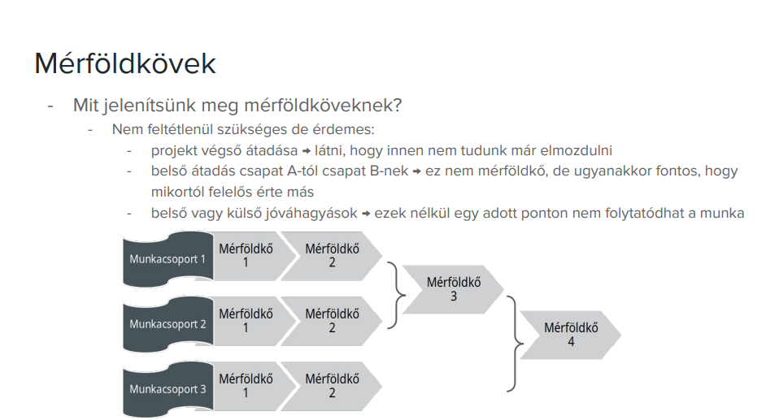

## 1-2. kérdés: Mutassa be a projekt előrehaladásának mérésére szolgáló lehetőségeket és eszközöket! Mutassa be a projektben résztvevő fejlesztők munkájának mérésére szolgáló lehetőségeket és elveket!

## 3. kérdés: Mutassa be a mérföldkövek szerepét, és mutassa be, hogyan használhatók a projekt irányításában!

### Hogyan használhatók a projekt irányításában?
- A projektet kisebb szakaszokra bontják segítségükkel.
- A projektvezető a mérföldkövek alapján ellenőrzi a határidők teljesülését.