## 1. kérdés: Mutassa be a projektmenedzsment módszertan fogalmát és célját!
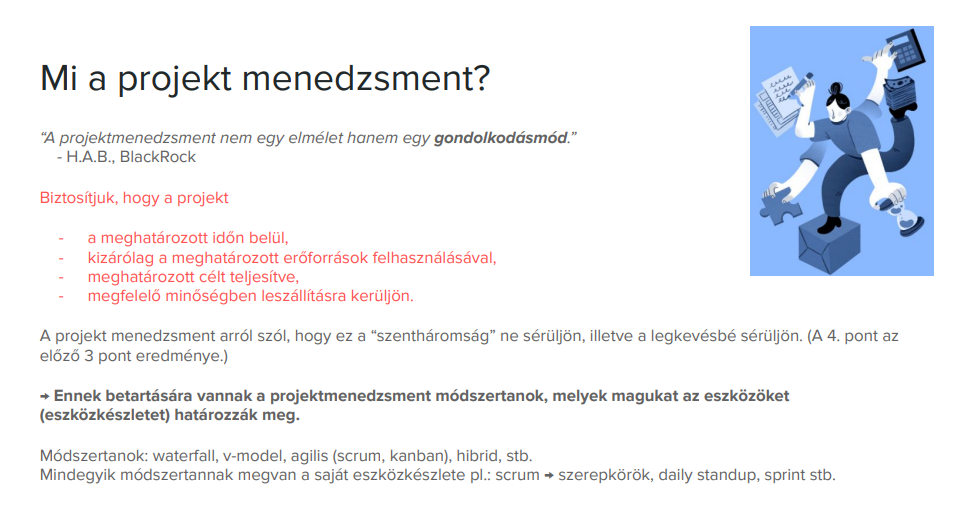
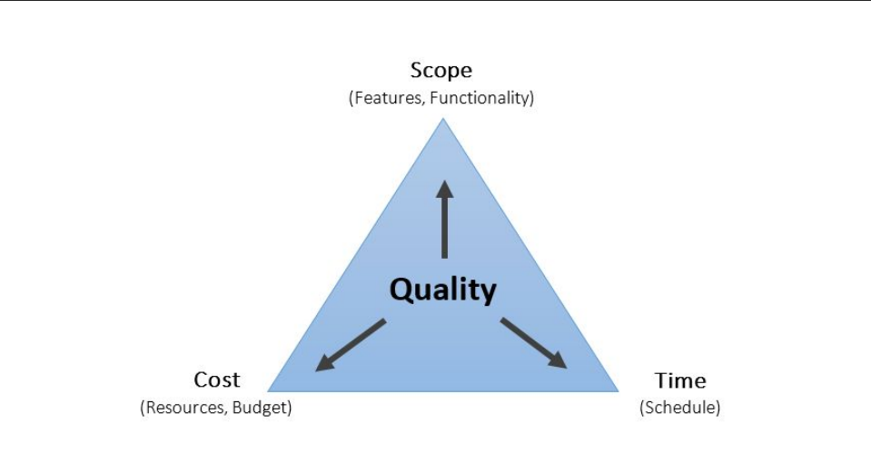
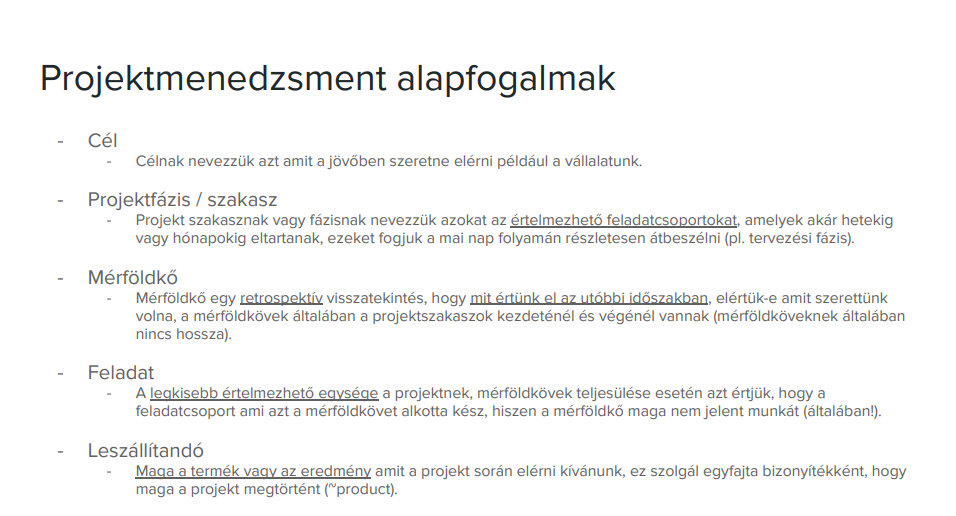
## 2-3. kérdés: Mutassa be a vízesés és agilis modellt részletesen! Mutassa be a SCRUM keretrendszert részletesen!
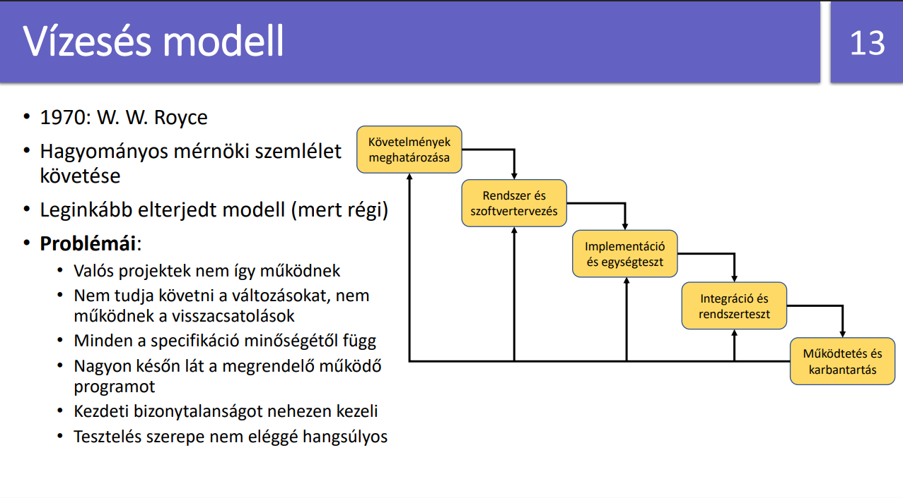
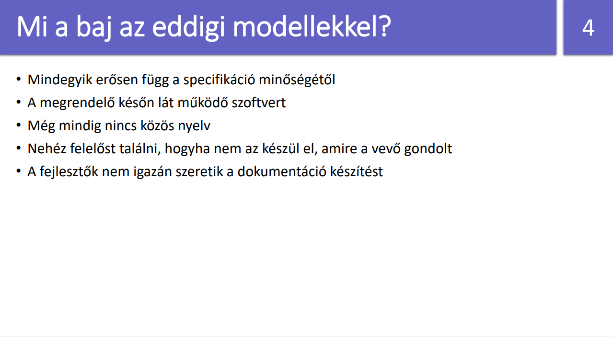
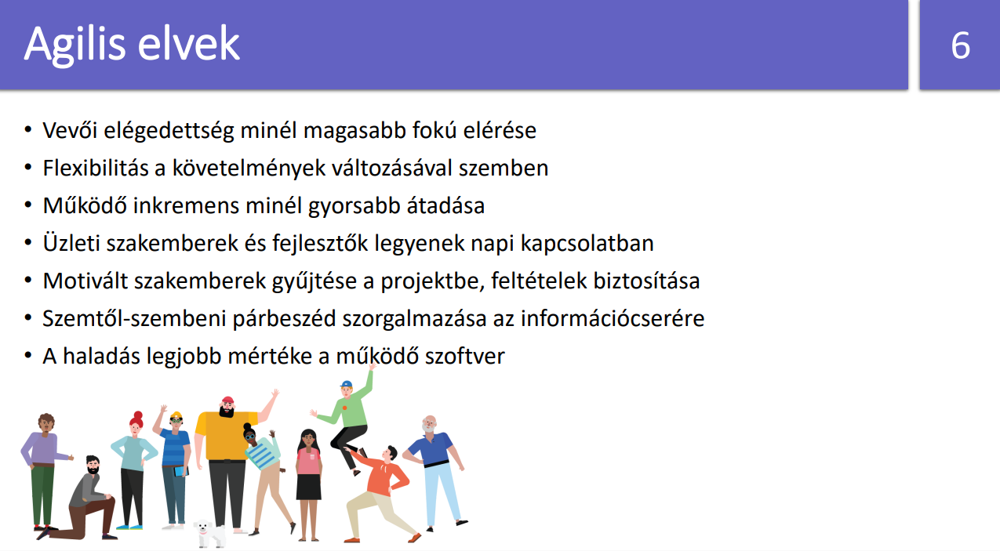
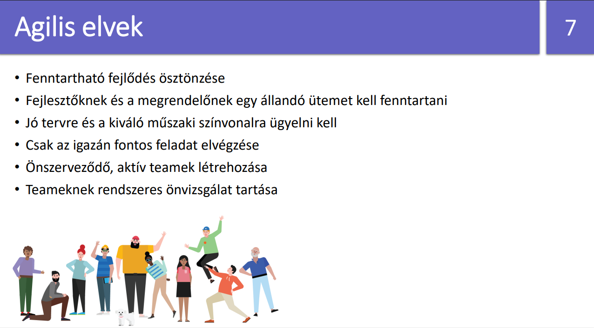
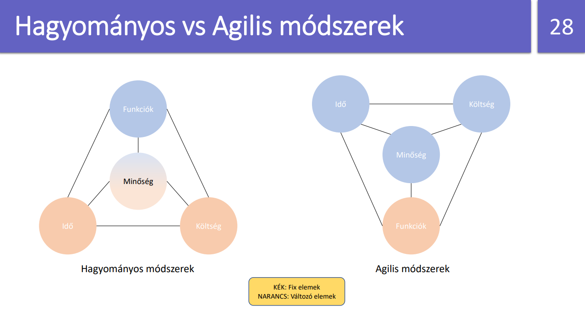
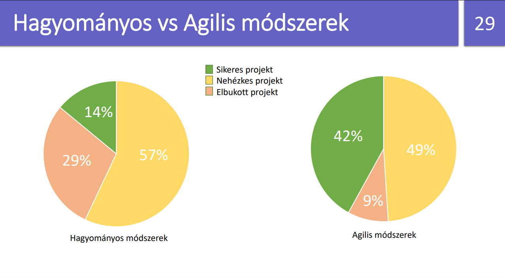
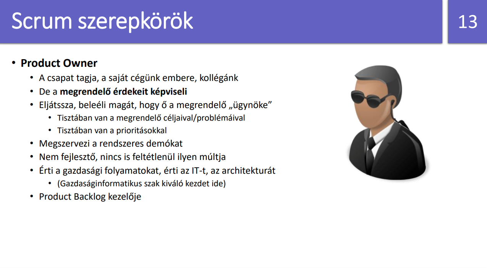
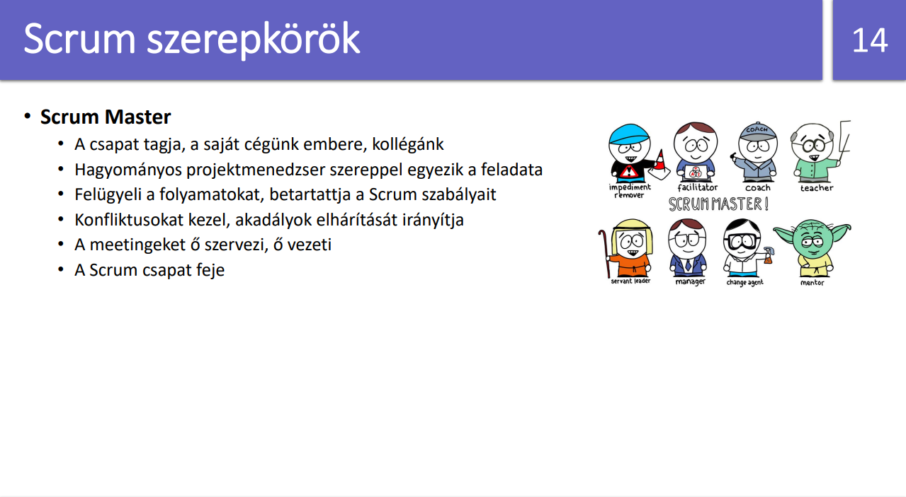
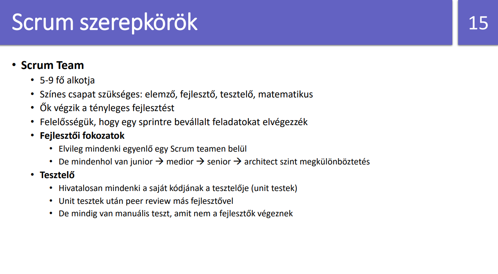
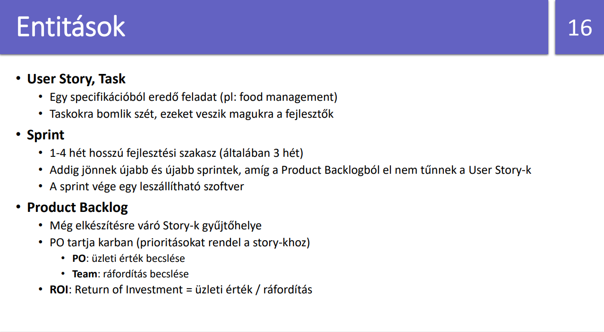
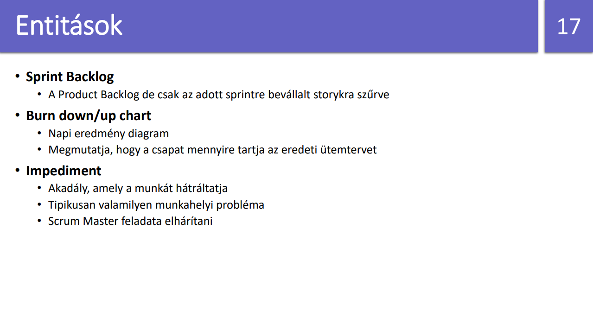
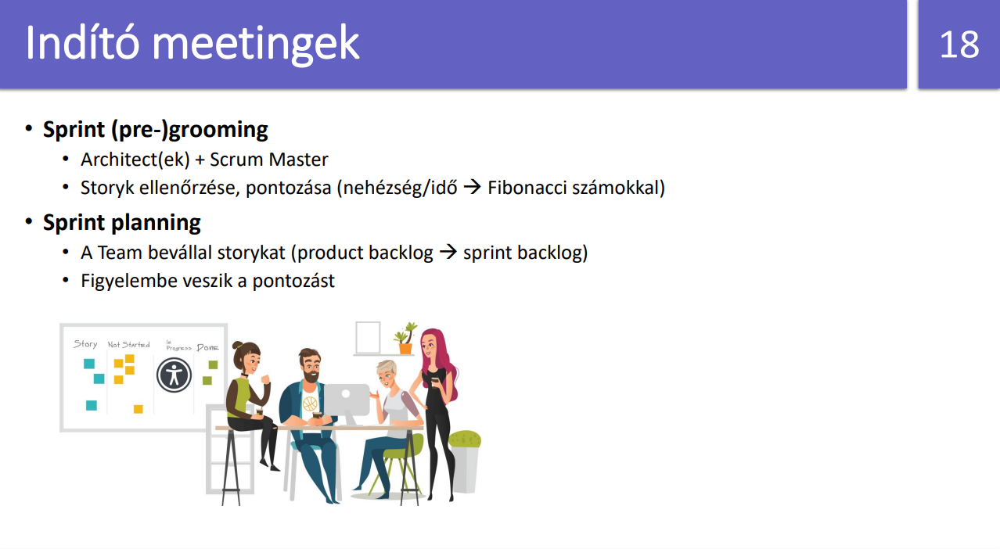
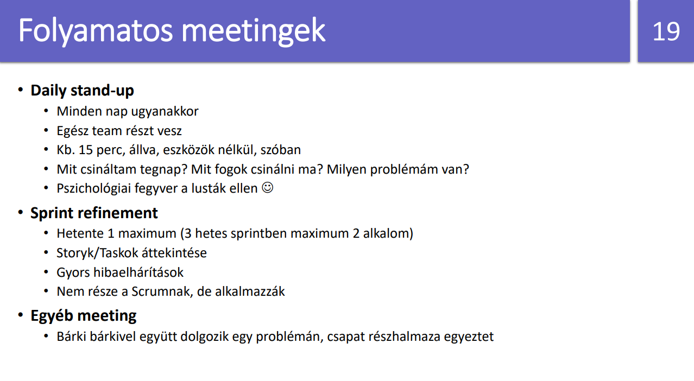
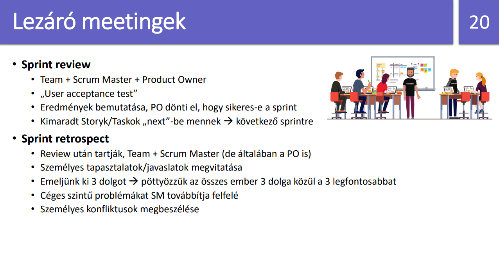
