## 1. krédés: Mutassa be az Agile Manifesto alapelveit és azok jelentőségét a modern szoftverfejlesztésben!

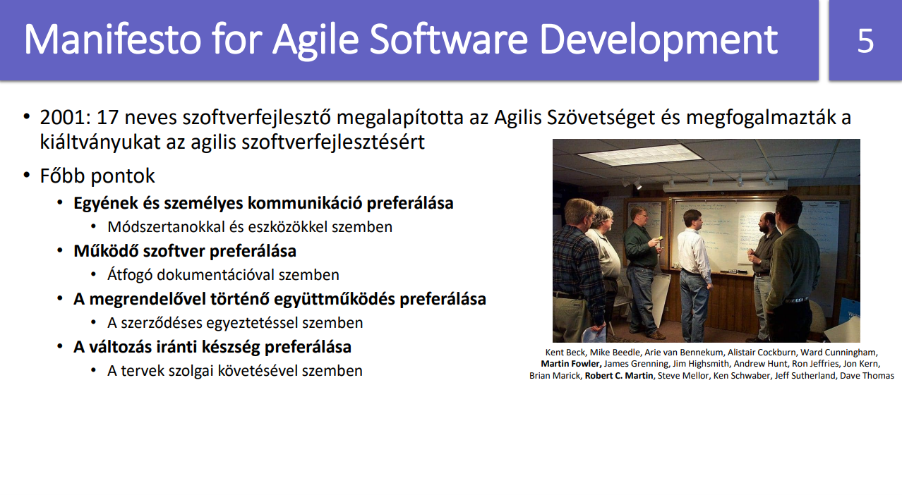
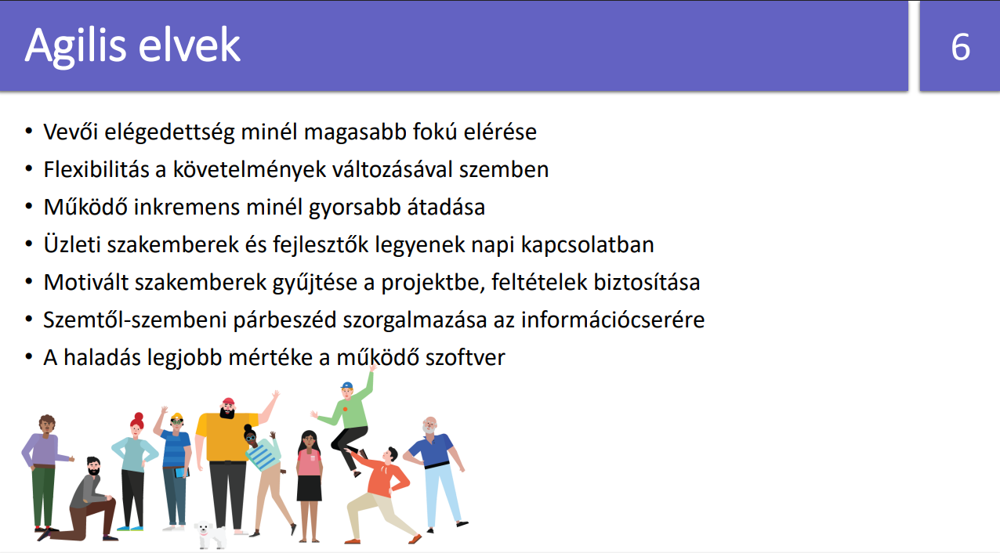
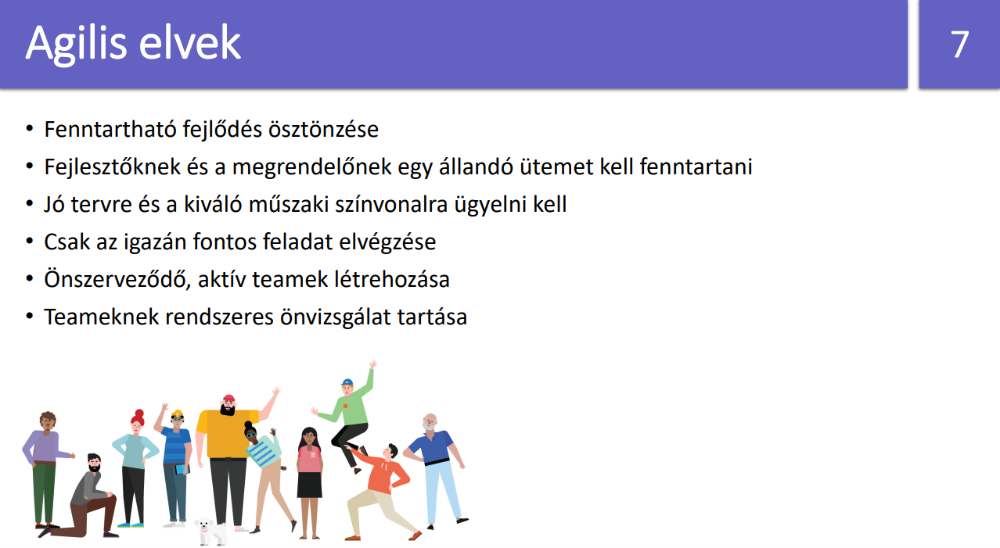
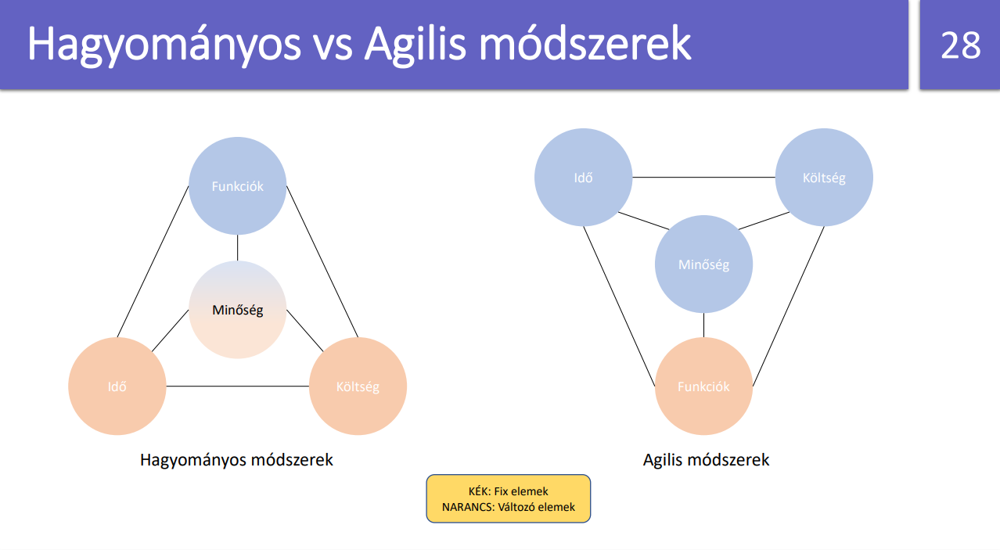
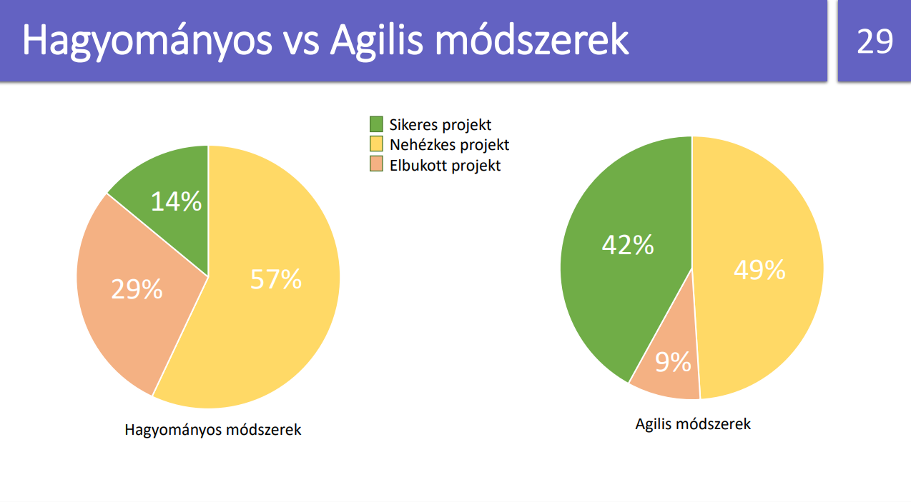

## 2-4. krédés: Mutassa be egy SCRUM alapú fejlesztés folyamatát, főbb lépéseit! Mutassa be a SCRUM szerepköröket, eseményeket! Mutassa be az issue kezelést, a verziókövetésen és csapatmunkán keresztül, a SCRUM rendszerben!

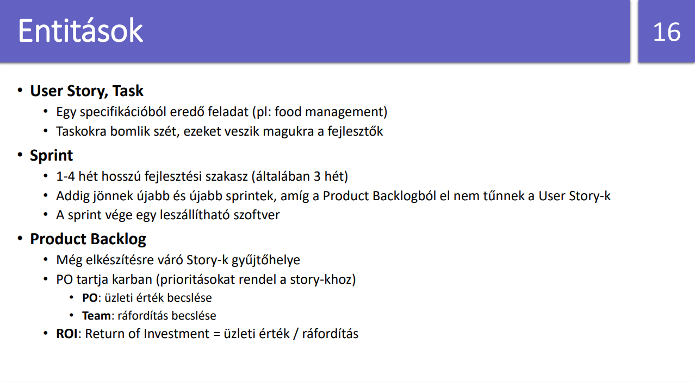
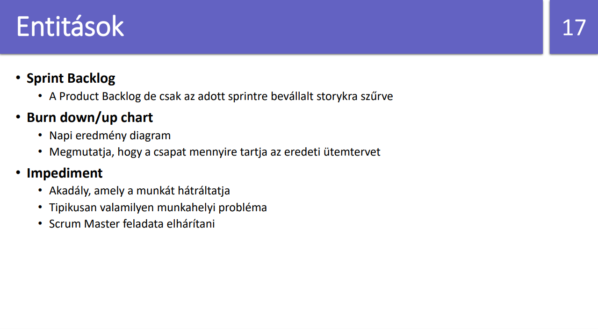
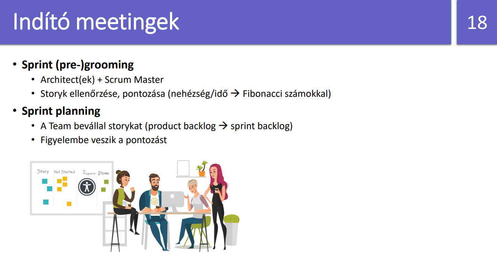
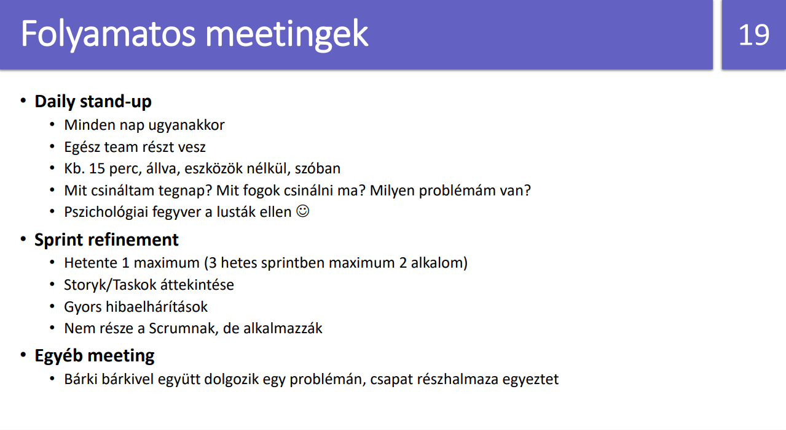
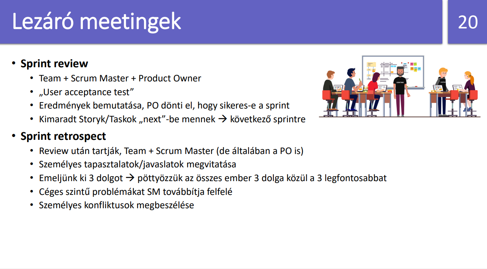
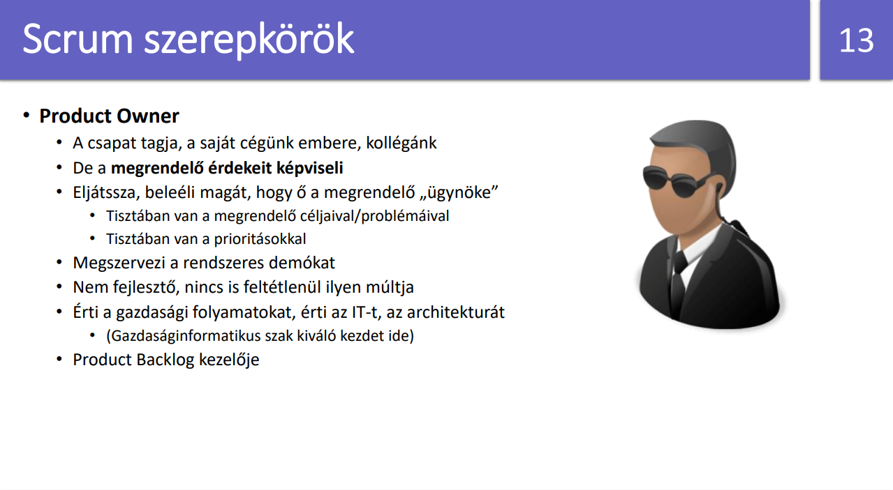
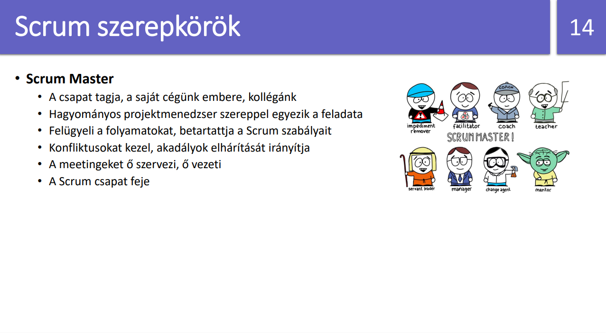
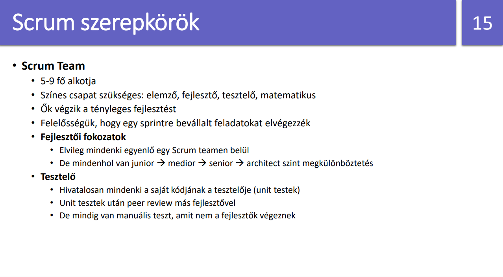
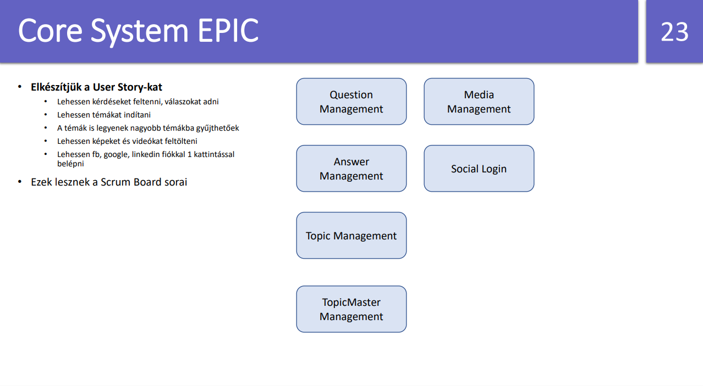
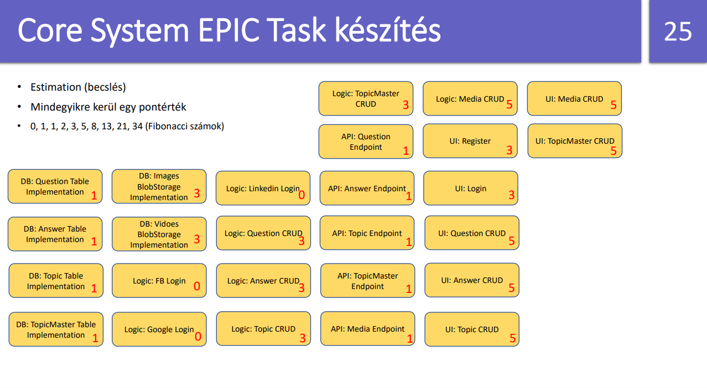
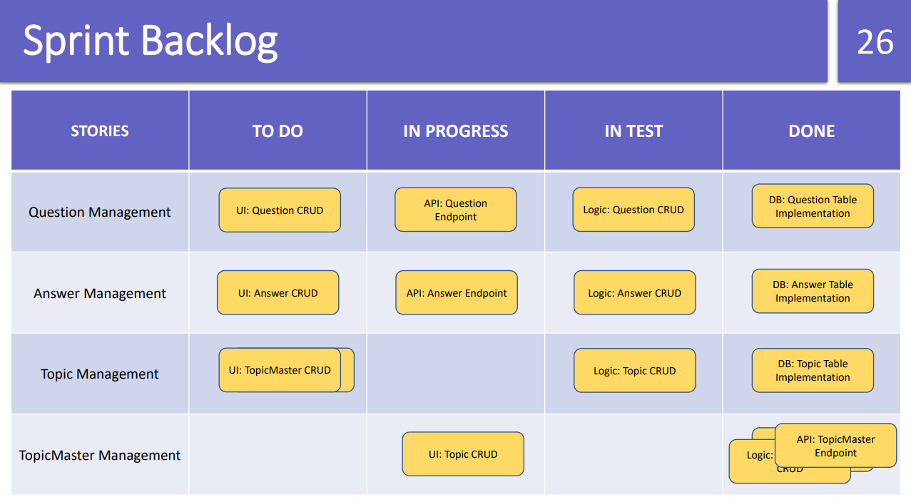

