## 1. kérdés: Mutassa be a tervezési minták alapvető céljait!

## 1. kérdés: Mutassa be a tervezési minták alapvető céljait!

- "Érdemes napjainkban ezeket a mintákat áttekinteni, saját problémákra
alkalmazni, mert a segítségükkel jól fenntartható, szépen strukturált kódot
kapunk."

ChatGPT válasza:

Fő céljaik:
```.txt
- Újrafelhasználhatóság növelése
    Ne kelljen minden problémára teljesen új megoldást írni.

- Karbantarthatóság javítása
    A jól felépített kód könnyebben módosítható és hibajavítható.

- Rugalmasabb rendszer kialakítása
    A program könnyebben bővíthető új funkciókkal.

- Laza csatolás biztosítása
    Az egyes osztályok és komponensek kevésbé függjenek egymástól.

- Átláthatóbb kód létrehozása
    Egységes szerkezetet és könnyebb megértést biztosítanak.

- Kommunikáció megkönnyítése fejlesztők között
    Egy minta neve önmagában leír egy ismert megoldást
    (pl. Singleton, Factory, Observer).

- Fejlesztési idő csökkentése
    Bevált megoldások használatával gyorsabb a fejlesztés.
```

## 2. kérdés: Mutassa be az Observer és State tervezési mintákat!

### OBSERVER

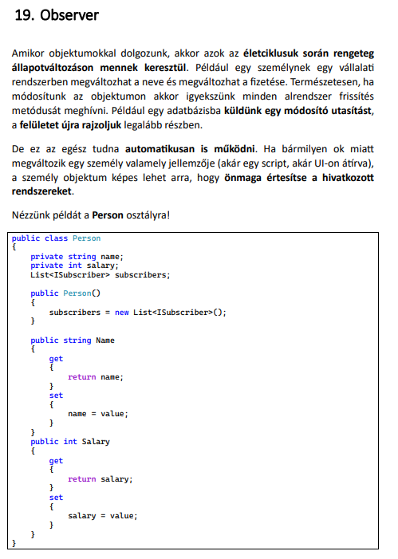
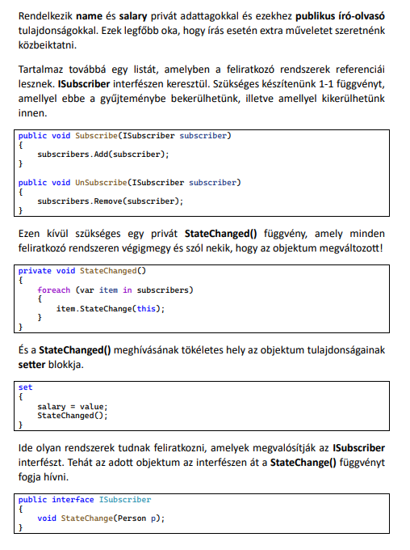
---
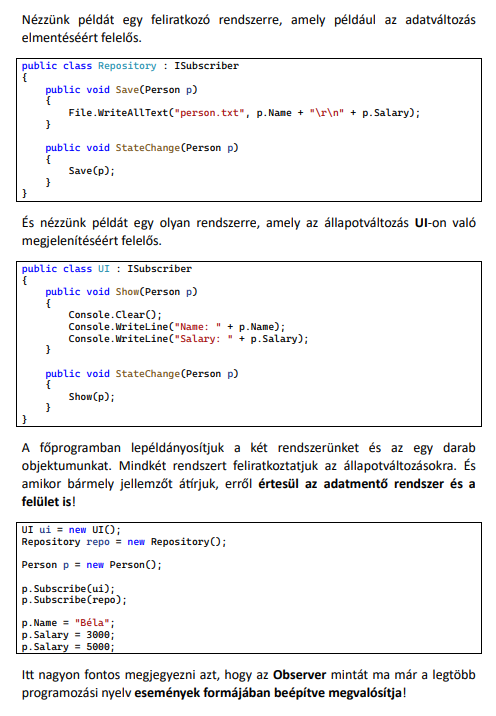

### STATE

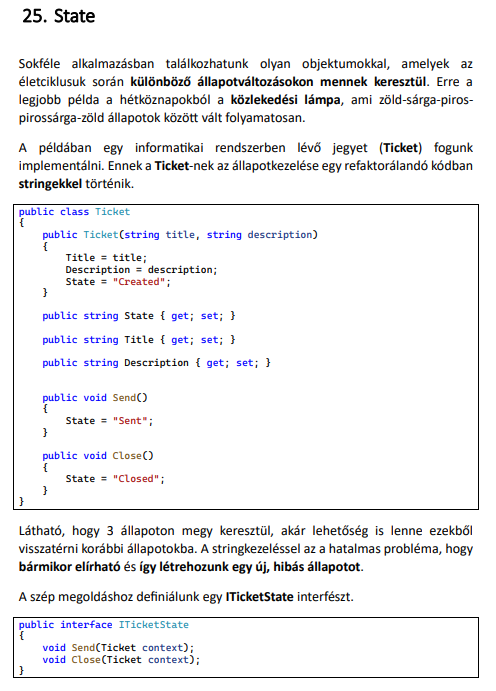
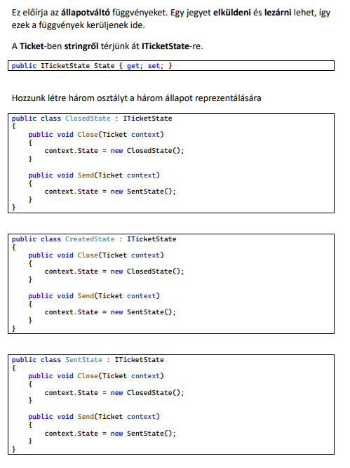
---
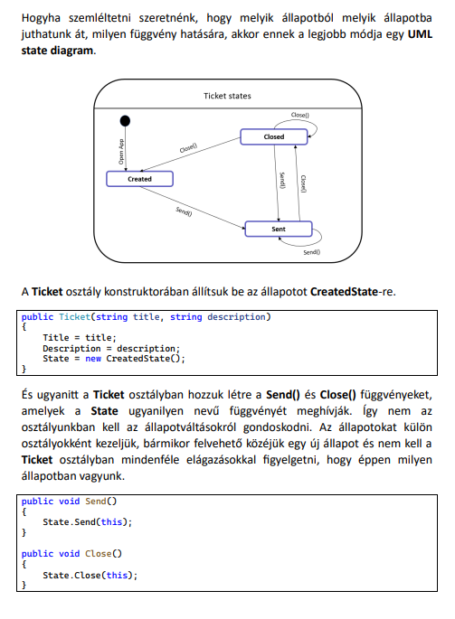

## 3. kérdés: Mutassa be a Strategy és Template Method tervezési mintákat!

### STATEGY

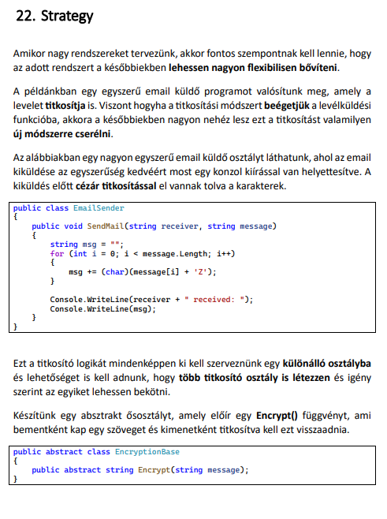
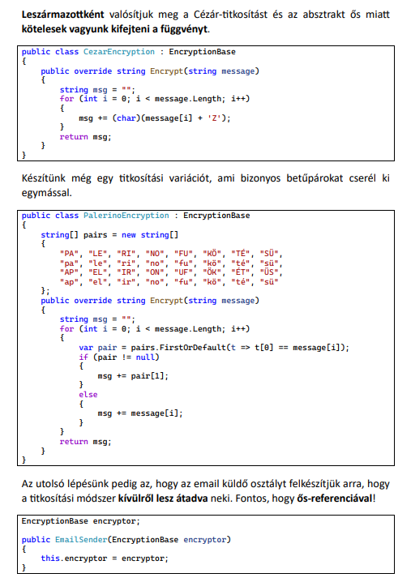
---
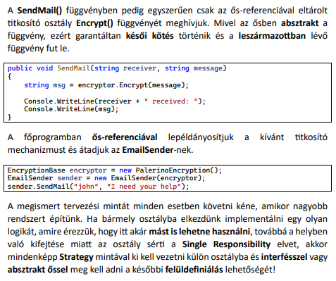

### TEMPLATE METHOD

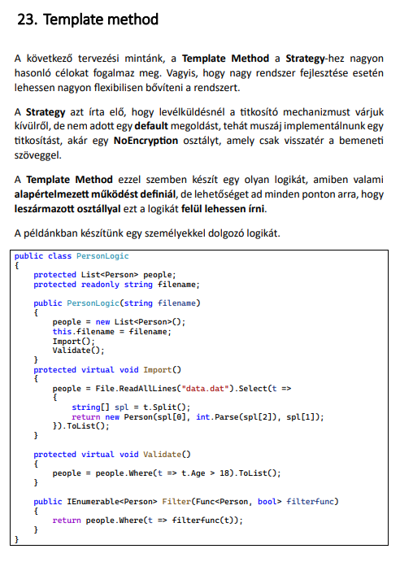
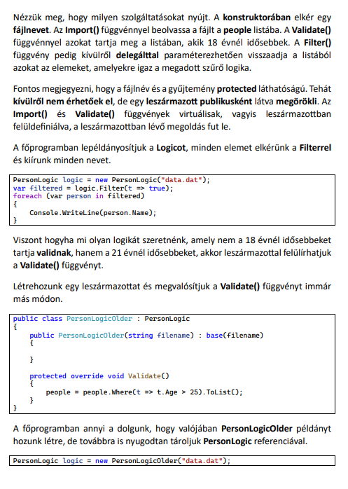
---
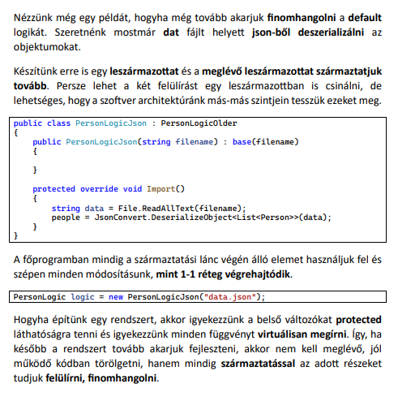

## 4. kérdés: Mutassa be a Visitor tervezési mintát!

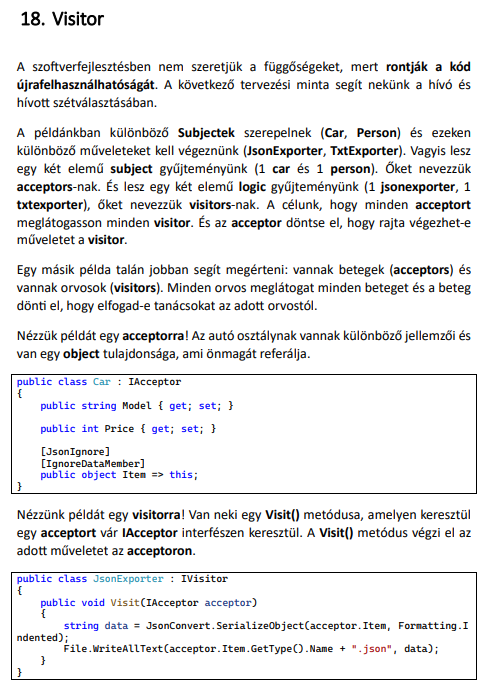
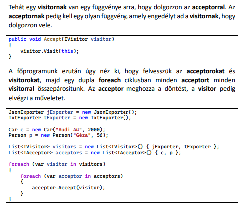